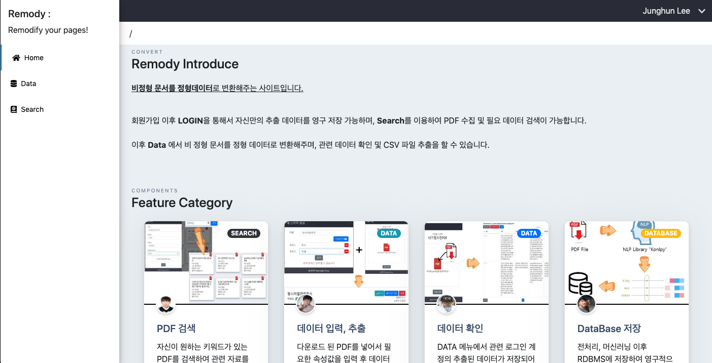
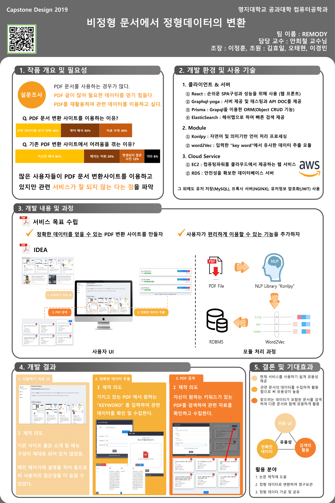

# remody-dashboard

  

### 당신의 논문을 더욱 쉽게! Remody

### 사진으로 보는 개요

### 개요

본 프로젝트는 2019년 컴퓨터공학과 캡스톤 프로젝트로서 비정형데이터의 정형데이터화에 의의가 있습니다. 여기서 말한 비정형 데이터란 pdf이며 정형데이터는 json등의 데이터를 의미합니다.
본 레포지토리는 대시보드입니다. 백엔드 레포지토리는 다음과 같습니다 [백엔드 레포지토리](https://github.com/remody/remody-server)

### [기능보기](feature.md)

### 실행 방법

1. 본 레포지토리를 클론해주세요
2. src/apollo에 링크를 백엔드 URL과 연결시켜주세요
3. yarn으로 모듈을 설치해주세요
4. yarn start로 개발모드를 실행 시켜주시면 됩니다!

**배포를 하실려면 build후에 해주세요!**

### 개발 스택

1. apollo 스택(apollo-react, apollo-hook등)
2. react
3. styled-components
4. bootstrap
