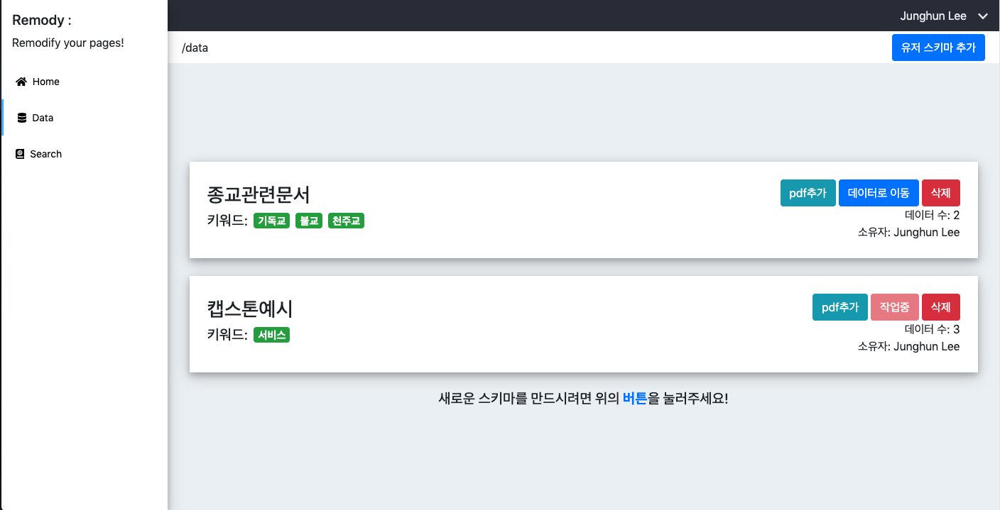
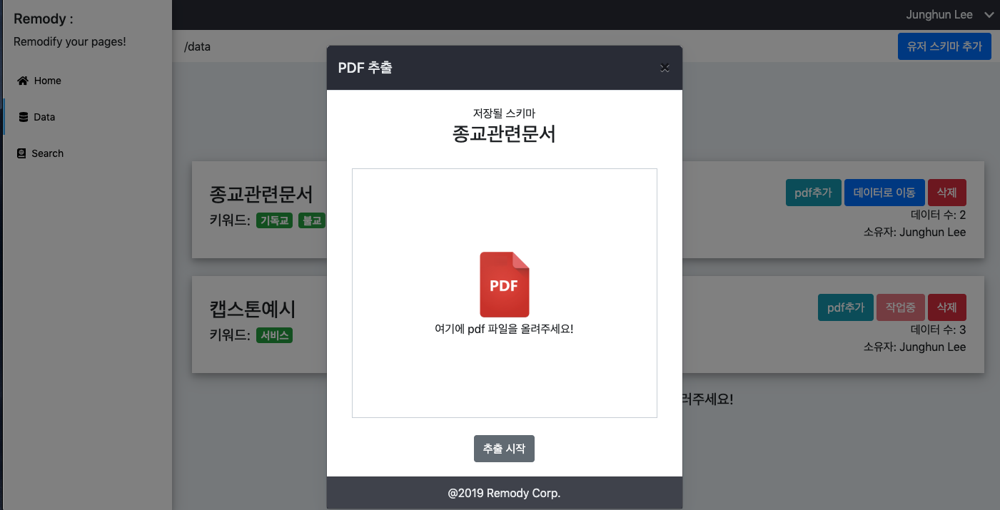
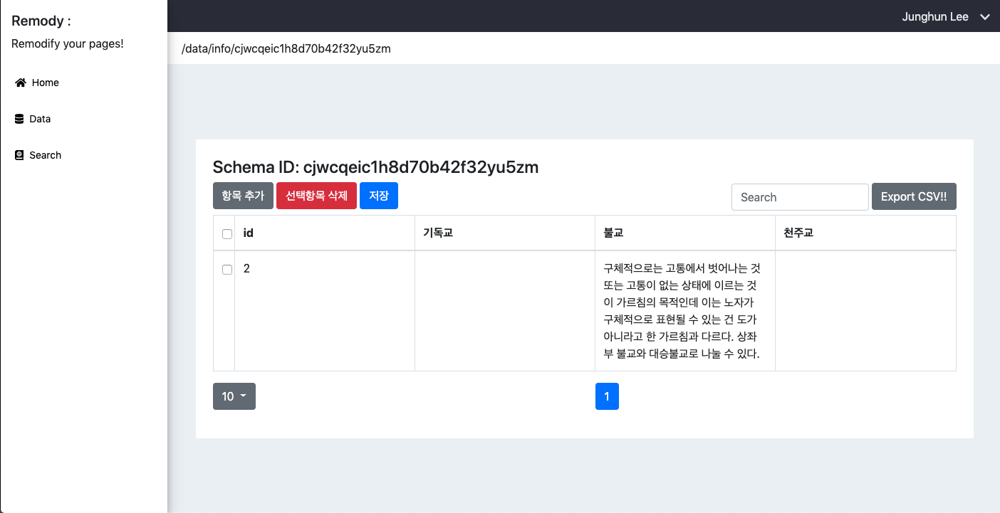
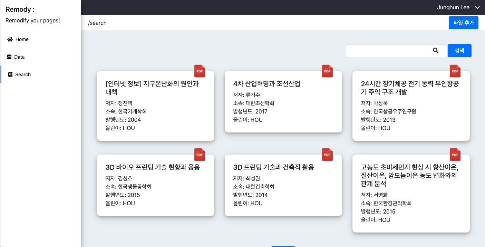
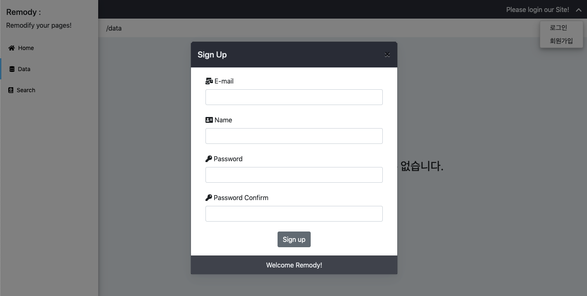

# Remody 페이지별 기능

  <h3>유저 스키마 기능</h3>
  
  
  
현재 유저가 가지고 있는 데이터 스키마를 보여줍니다.이렇게 모달창에 pdf형식인 논문을 넣어서 데이터를 추출할 수 있습니다. 또한 데이터를 추출하기 위한 스키마를 만들 수 있는데 유저 스키마 추가라는 버튼을 누르고 키워드를 입력해주면 MYSQL에 테이블이 생깁니다

   
  <h3>추출데이터 CRUD 기능(개인화 디비)</h3>
  
  
각 유저 별 테이블을 제공하고 그 테이블에 대하여 조회, 수정, 생성, 삭제등의 기본 기능을 제공합니다. 또한 추가기능으로서 검색, 페이지네이션, CSV로 다운로드등의 기능을 제공합니다.

   
  <h3>논문 상세 검색</h3>
  
  
디비를 검색하여 전달해주는 것은 좋은 방법중에 하나입니다. 하지만 유저는 바쁘고 더 정교한 정보가 필요합니다. 정확한 검색이 필요하다고 생각했습니다. 고로 어디서 발견됐는지에 대하여 가중치를 주고 더욱 나아가 pdf를 전처리하여 본문을 추출후에 분석하여 본문검색을 가능하게 하였습니다. 당연히 검색 후에 논문을 볼 수 있습니다.

   
  <h3>기본 유저 기능</h3>
  
  
유저별로 다른 서비스를 제공해야하니 인증서버를 만들었습니다. 로그인, 로그아웃, 회원가입, 탈퇴, 개인정보 변경, 등록한 파일 삭제, 이메일을 통한 비밀번호 찾기를 구현하였습니다.

   

